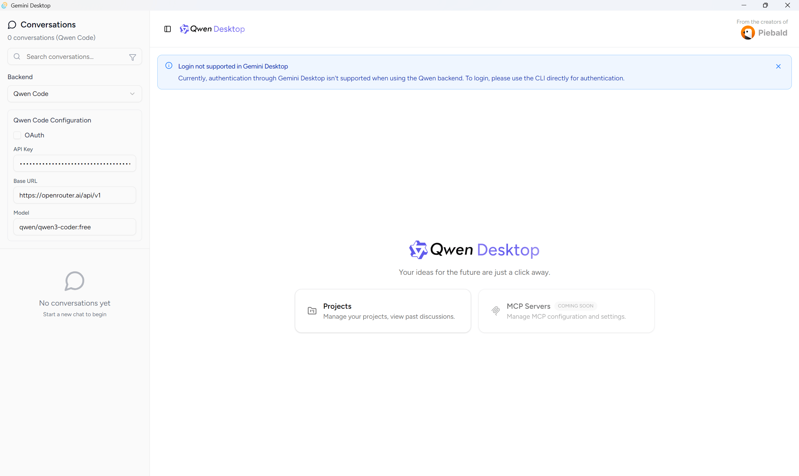

# Your Gemini, Reimagined.

Ever felt that the command line, while powerful, can be a bit... impersonal? Gemini Desktop is a beautiful and intuitive graphical interface for Google's Gemini CLI and Qwen Code, designed to make your interactions with AI more natural and productive.

**So, why use a graphical interface instead of the command line?**

*   **It's easier.** No need to memorize commands or flags. Everything is a click away.
*   **It's visual.** See your conversations, code changes, and the AI's thought process laid out clearly.
*   **It's more powerful for complex tasks.** Juggling multiple conversations, reviewing large code changes, and managing files is a breeze.
*   **Access from anywhere.** With the web version, you can use your Gemini CLI running on one machine from any other device with a web browser.




## What you can do with Gemini Desktop

*   **Chat with your AI, effortlessly.** Have natural, flowing conversations with your AI. All your chats are automatically saved for you to come back to at any time.
*   **See the AI's thought process.** Understand how the AI is working behind the scenes by watching its thoughts unfold in real-time.
*   **Review code changes with confidence.** A clear, side-by-side view of proposed code changes makes it easy to see what's new and decide whether to accept it.
*   **Work with different AI models.** Easily switch between different Gemini and Qwen models to find the best one for your needs.
*   **Search your entire chat history.** Instantly find any message or piece of code from your past conversations.

## Getting Started

To get started, you'll need to build Gemini Desktop from the source code. Here's how:

### 1. Install the Prerequisites

Gemini Desktop is built with Rust and web technologies. You'll need to install the following tools first.

*   [Rust](https://rust-lang.org)
*   [Node.js](https://nodejs.org)
*   [pnpm](https://pnpm.io)
*   [just](https://just.systems)

#### Installing `just`

`just` is a handy command runner we use to simplify the build process.

*   **On macOS/Linux with `asdf`:**

    ```bash
    asdf plugin add just
    asdf install just latest
    ```

*   **On Ubuntu:**

    You can also install `just` using snap:

    ```bash
    snap install --edge --classic just
    ```

*   **On Windows:**

    ```powershell
    winget install --id Casey.Just
    ```

#### Linux Dependencies

On Linux, you'll need a few extra packages for the desktop app to build correctly.

*   **On Ubuntu:**

    ```bash
    sudo apt install libgdk-pixbuf-2.0-dev \
       libpango1.0-dev \
       libjavascriptcoregtk-4.1-dev \
       libatk1.0-dev \
       libsoup-3.0-dev \
       libwebkit2gtk-4.1-dev
    ```

### 2. Clone the Repository

```bash
git clone https://github.com/Piebald-AI/gemini-desktop
cd gemini-desktop
```

### 3. Build the Application

This command will download all the necessary dependencies and build both the desktop and web versions of the application.

```bash
just deps build-all
```

### 4. Run Your Build

Here’s how to run the applications you’ve just built:

**Desktop App**

For the best experience, use the installer. It will set up the application on your system, just like any other app.

```bash
# Navigate to the bundle directory
cd target/release/bundle/

# Run the installer for your system (the file name will vary)
# For example, on Linux it might be:
./Gemini.Desktop_0.1.0_amd64.AppImage
```

If you prefer to run the application without installing, you can run the executable directly:

```bash
./target/release/gemini-desktop
```

**Web App (Web Server)**

This will start a web server on your machine. You can then access Gemini Desktop from your browser.

```bash
# Run the web server executable
./target/release/gemini-desktop-web
```

Once the server is running, open your web browser and go to `http://localhost:1858`.

## Features

- Choose between Gemini models (Gemini 2.5 Pro, Gemini 2.5 Flash, Gemini 2.5 Flash-Lite)
- Use **Qwen.ai OAuth/custom OpenAI-compatible providers** and models with Qwen Code
- Send messages to/from AI and receive response; handle tool call requests; Markdown support
- Observe Gemini's **thought process**
- View and handle edit requests with clear file diffs
- Automatic light/dark mode switching
- **Automatic chat history saving** (Note: See related PRs [#4401](https://github.com/google-gemini/gemini-cli/pull/4401) and [#4609](https://github.com/google-gemini/gemini-cli/pull/4609) on the Gemini CLI repo.)
- Fast **search** across all conversation contents
- Access Gemini CLI/Qwen Code running on **remote machines** with the web UI

### Planned/in progress

- MCP server management and integration
- Git repository viewing
- Dangerous `--yolo` mode support
- Resuming saved conversations
- Token/cost information
- `@`-mentioning files
- LLxprt integration ([#24](https://github.com/Piebald-AI/gemini-desktop/issues/24))
- Multi-modal support
- Extension support

## Contributing

Contributions are welcome! Please see the [contributing guide](CONTRIBUTING.md) for more details.

## License

[MIT](./LICENSE)

Copyright © 2025 [Piebald LLC.](https://piebald.ai)
